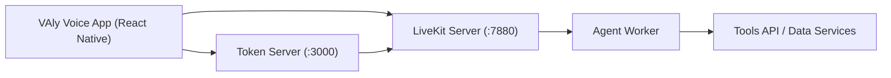

# VAly Voice App

React Native mobile client for VAly voice sessions over LiveKit.

This repository is a client example app. Core backend/agent code lives in other repositories.

## Related Repositories

- Main backend monorepo: [voiceagentlive-openai](https://github.com/birlianil/voiceagentlive-openai)
- Split backend repos:
  - [va-voice-agent-worker](https://github.com/birlianil/va-voice-agent-worker)
  - [va-voice-token-server](https://github.com/birlianil/va-voice-token-server)
  - [va-voice-tools-api](https://github.com/birlianil/va-voice-tools-api)

## Features

- Connect to custom `token-server` and LiveKit server
- Optional `x-api-key` header support for `/token`
- Join voice room with chosen room name and identity
- Development build workflow for Android and iOS

## Architecture



## Quick Start

1. Install dependencies:

```bash
cd /Users/anilbirli/Documents/va-voice-codex
npm install
```

2. Start backend stack in the main backend repository:
- `token-server` on `3000`
- `livekit` on `7880`
- `agent-worker` connected to LiveKit

3. Start development server:

```bash
npm run start:dev
```

4. Open app and set:
- Token URL: `http://<LAN_IP>:3000`
- LiveKit WS: `ws://<LAN_IP>:7880`

## Important: Expo Go vs Dev Build

This app uses LiveKit React Native + WebRTC native modules.

- `Expo Go`: not suitable for this app
- `Development Build`: required

## Documentation

- Setup guide: [docs/SETUP_GUIDE.md](docs/SETUP_GUIDE.md)
- End-to-end runbook: [docs/E2E_RUNBOOK.md](docs/E2E_RUNBOOK.md)
- System architecture: [docs/SYSTEM_ARCHITECTURE.md](docs/SYSTEM_ARCHITECTURE.md)
- Stack and versions: [docs/STACK_AND_VERSIONS.md](docs/STACK_AND_VERSIONS.md)
- Repo relations: [docs/REPO_RELATIONS.md](docs/REPO_RELATIONS.md)
- Project report: [docs/PROJECT_REPORT.md](docs/PROJECT_REPORT.md)
- GitHub Pages landing: [docs/index.md](docs/index.md)
- Changelog: [CHANGELOG.md](CHANGELOG.md)

## Publish As Separate GitHub Repo

```bash
cd /Users/anilbirli/Documents/va-voice-codex
git init
git add .
git commit -m "chore: initialize VAly Voice App"
git branch -M main
git remote add origin <NEW_REPO_URL>
git push -u origin main
```
