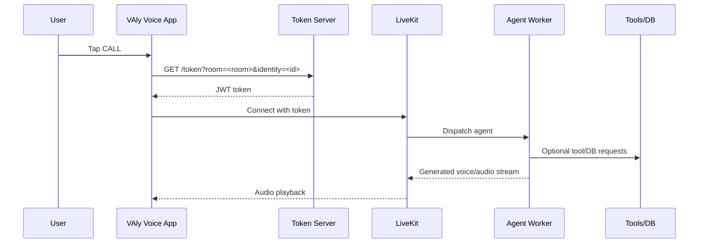

# System Architecture

This repository (`valy-voice-app`) is a mobile client sample. It connects to a local/remote voice stack and does not contain backend agent runtime logic.

## 1. Components

- Mobile client (this repo): React Native + Expo development build
- Token Server (backend repo): issues LiveKit access token via `/token`
- LiveKit Server: room transport, media routing, participant events
- Agent Worker: joins room as an agent and produces speech responses
- Tools API / Database layer: optional external tools, KB retrieval, business logic

Main backend repository:
- https://github.com/birlianil/voiceagentlive-openai

## 2. End-to-End Flow

## 3. Local Topology (Typical)

- Mobile app dev server: `http://<LAN_IP>:8081`
- Token server: `http://<LAN_IP>:3000`
- LiveKit WebSocket: `ws://<LAN_IP>:7880`
- Optional tools API starter: `http://<LAN_IP>:4011`

## 4. Required Runtime Inputs

For the mobile app:
- Token Server URL
- LiveKit WebSocket URL
- Optional API Key (`x-api-key`)
- Room name

For backend stack:
- `OPENAI_API_KEY`
- LiveKit API credentials (`LIVEKIT_API_KEY`, `LIVEKIT_API_SECRET`)
- Optional DB and Supabase connection values

## 5. OpenAI + Supabase Usage Pattern

- OpenAI:
  - LLM: response generation in agent worker
  - STT: speech-to-text (optional cloud path)
  - TTS: text-to-speech (optional cloud path)
- Supabase:
  - Optional Postgres backend for tools/KB features
  - Can be used by setting `SUPABASE_DB_URL` and wiring `DATABASE_URL`

## 6. Responsibility Boundary

This app is intentionally thin:
- It handles connection UX, token fetch, and room join.
- It does not implement prompt orchestration, tool contracts, or DB business rules.

Those belong to backend repositories and services.
