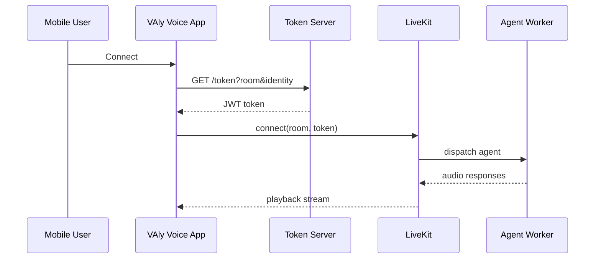

# VAly Voice App

Client-facing mobile app for VAly voice sessions.

## Product Snapshot

- Platform: React Native + Expo Development Build
- Realtime: LiveKit voice room
- Auth: Token-based join via token-server
- Use case: Fast mobile validation for VAly voice experiences

## Start Here

- [Kurulum Rehberi (TR)](SETUP_GUIDE_TR.md)
- [E2E Runbook (TR)](E2E_RUNBOOK_TR.md)
- [Repo Relationships](REPO_RELATIONS.md)
- [Proje Raporu (TR)](PROJECT_REPORT_TR.md)

## What Is In This Repo

- Mobile app UI + LiveKit room join flow
- Token request flow (`/token`)
- Development build setup (`eas.json`, `expo-dev-client`)

## What Is NOT In This Repo

- Agent orchestration runtime
- Token-server implementation
- Tools backend implementation

For those, see:
- [voiceagentlive-openai](https://github.com/birlianil/voiceagentlive-openai)

## End-to-End Flow

